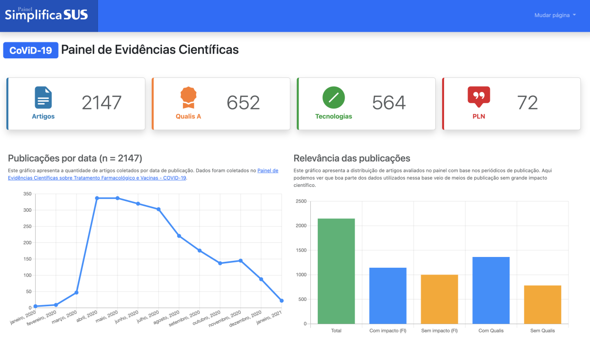

**Autores:** Frederico Carvalho, Diego Mariano, Marcos Matos
**Protótipo:** Disponível em: <a href="http://inovasus.alfahelix.com.br/">http://inovasus.alfahelix.com.br/</a>.

# Subdiretórios:
- **web**: armazena o código fonte da aplicação Laravel que executa a interface do Painel SimplificaSUS.
- **dados**: diretório que armazena as bases de dados utilizadas.

# 2ª etapa 

# 1ª etapa 

## Hackathon Inovadados SUS: Painel SimplificaSUS
Repositório de armazenamento dos dados e códigos fonte usados no Hackathon Inovadados SUS 2022.

**Vídeo apresentando a ferramenta:** <a href="https://youtu.be/rjjsh-I5r_A">https://youtu.be/rjjsh-I5r_A</a>

**Relatório da primeira fase:** <a href="./dados/primeira_fase/relatorio_final.pdf">relatorio_final.pdf</a>
